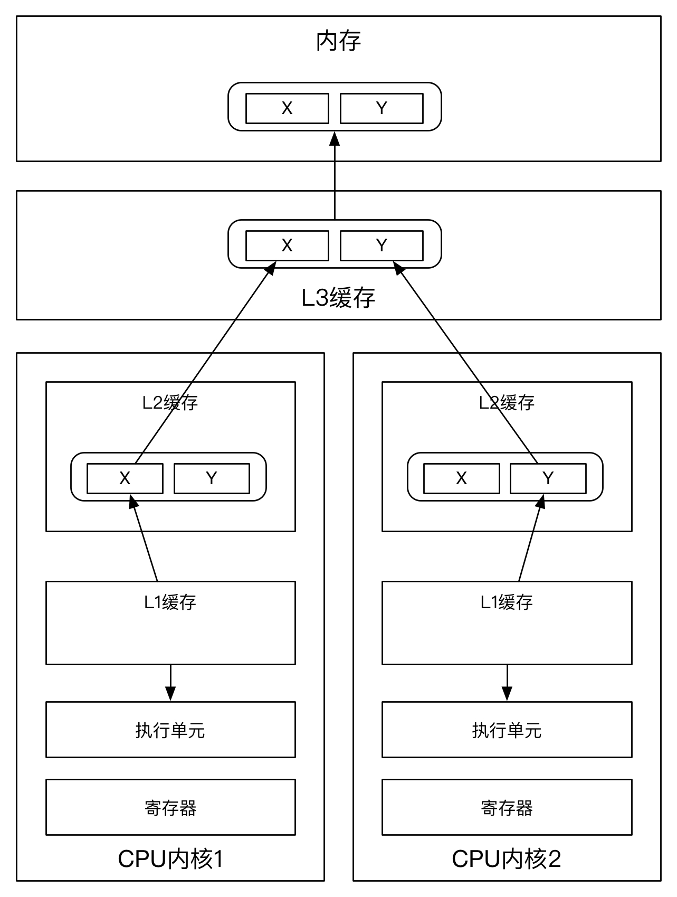
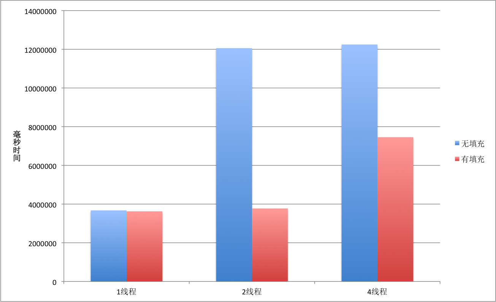

# 伪共享和缓存行

在计算机系统中，内存是以缓存行为单位存储的，一个缓存行存储字节的数量为2的倍数，在不同的机器上，缓存行大小为32字节到256字节不等，通常来说为64字节。伪共享指的是在多个线程同时读写同一个缓存行的不同变量的时候，尽管这些变量之间没有任何关系，但是在多个线程之间仍然需要同步，从而导致性能下降的情况。在对称多处理器结构的系统中，伪共享是影响性能的主要因素之一，由于很难通过走查代码的方式定位伪共享的问题，因此，大家把伪共享称为“性能杀手”。

为了通过增加线程数来达到计算能力的水平扩展，我们必须确保多个线程不能同时对一个变量或者缓存行进行读写。我们可以通过代码走查的方式，定位多个线程读写一个变量的情况，但是，要想知道多个线程读写同一个缓存行的情况，我们必须先了解系统内存的组织形式，如下图所示。



从上图看到，线程1在CPU核心1上读写变量X，同时线程2在CPU核心2上读写变量Y，不幸的是变量X和变量Y在同一个缓存行上，每一个线程为了对缓存行进行读写，都要竞争并获得缓存行的读写权限，如果线程2在CPU核心2上获得了对缓存行进行读写的权限，那么线程1必须刷新它的缓存后才能在核心1上获得读写权限，这导致这个缓存行在不同的线程间多次通过L3缓存来交换最新的拷贝数据，这极大的影响了多核心CPU的性能。如果这些CPU核心在不同的插槽上，性能会变得更糟。

现在，我们学习JVM对象的内存模型。所有的Java对象都有8字节的对象头，前四个字节用来保存对象的哈希码和锁的状态，前3个字节用来存储哈希码，最后一个字节用来存储锁状态，一旦对象上锁，这4个字节都会被拿出对象外，并用指针进行链接。剩下4个字节用来存储对象所属类的引用。对于数组来讲，还有一个保存数组大小的变量，为4字节。每一个对象的大小都会对齐到8字节的倍数，不够8字节部分需要填充。为了保证效率，Java编译器在编译Java对象的时候，通过字段类型对Java对象的字段进行排序，如下表所示。

|顺序|类型|字节数量|
|:-:|:-:|:-:|
|1|double|8字节|
|2|long|8字节|
|3|int|4字节|
|4|float|4字节|
|5|short|2字节|
|6|char|2字节|
|7|boolean|1字节|
|8|byte|1字节|
|9|对象引用|4字节或者8字节|
|10|子类字段|重新排序|

因此，我们可以在任何字段之间通过填充长整型的变量把热点变量隔离在不同的缓存行中，通过减少伪同步，在多核心CPU中能够极大的提高效率。

下面，我们通过一个测试用例来证明我们的理论分析的正确性，参考下面的代码段。

```java
package com.robert.concurrency.cacheline;

/**
 * 
 * @author：李艳鹏
 * @since：Jun 11, 2017 1:01:29 AM
 * @version: 1.0
 */
public final class FalseSharingDemo {

    // 测试用的线程数
    private final static int NUM_THREADS = 4;

    // 测试的次数
    private final static int NUM_TEST_TIMES = 10;

    // 无填充、无缓存行对齐的对象类
    static class PlainHotVariable {

        public volatile long value = 0L;
    }

    // 有填充、有缓存行对齐的对象类
    static final class AlignHotVariable extends PlainHotVariable {

        public long p1, p2, p3, p4, p5, p6;
    }

    static final class CompetitorThread extends Thread {

        private final static long ITERATIONS = 500L * 1000L * 1000L;

        private PlainHotVariable plainHotVariable;

        public CompetitorThread(final PlainHotVariable plainHotVariable) {
            this.plainHotVariable = plainHotVariable;
        }

        @Override
        public void run() {
            // 一个线程对一个变量进行大量的存取操作
            for (int i = 0; i < ITERATIONS; i++) {
                plainHotVariable.value = i;
            }

        }

    }

    public static long runOneTest(PlainHotVariable[] plainHotVariables) throws Exception {
        // 开启多个线程进行测试
        CompetitorThread[] competitorThreads = new CompetitorThread[plainHotVariables.length];
        for (int i = 0; i < plainHotVariables.length; i++) {
            competitorThreads[i] = new CompetitorThread(plainHotVariables[i]);
        }

        final long start = System.nanoTime();
        for (Thread t : competitorThreads) {
            t.start();
        }

        for (Thread t : competitorThreads) {
            t.join();
        }

        // 统计每次测试使用的时间
        return System.nanoTime() - start;
    }

    public static boolean runOneCompare(int theadNum) throws Exception {
        PlainHotVariable[] plainHotVariables = new PlainHotVariable[theadNum];

        for (int i = 0; i < theadNum; i++) {
            plainHotVariables[i] = new PlainHotVariable();
        }

        // 进行无填充、无缓存行对齐的测试
        long t1 = runOneTest(plainHotVariables);

        AlignHotVariable[] alignHotVariable = new AlignHotVariable[theadNum];

        for (int i = 0; i < NUM_THREADS; i++) {
            alignHotVariable[i] = new AlignHotVariable();
        }

        // 进行有填充、有缓存行对齐的测试

        long t2 = runOneTest(alignHotVariable);

        System.out.println("Plain: " + t1);
        System.out.println("Align: " + t2);

        // 返回对比结果
        return t1 > t2;
    }

    public static void runOneSuit(int threadsNum, int testNum) throws Exception {
        int expectedCount = 0;
        for (int i = 0; i < testNum; i++) {
            if (runOneCompare(threadsNum))
                expectedCount++;
        }

        // 计算有填充、有缓存行对齐的测试场景下响应时间更短的情况的概率
        System.out.println("Radio (Plain < Align) : " + expectedCount * 100D / testNum + "%");
    }

    public static void main(String[] args) throws Exception {
        runOneSuit(NUM_THREADS, NUM_TEST_TIMES);
    }
}

```

在上面的代码示例中，我们做了10次测试，每次对不填充的变量和填充的变量进行大量读写所花费的时间对比来判断伪同步对性能的影响。在每次对比中，我们首先创建了具有4个普通对象的数组，每个对象里包含一个长整形的变量，由于长整形占用8个字节，对象头占用8个字节，每个对象占用16个字节，4个对象占用64个字节，因此，他们很有可能在同一个缓存行内。

```java
	...
	
    // 无填充、无缓存行对齐的对象类
    static class PlainHotVariable {

        public volatile long value = 0L;
    }

	...
	
    PlainHotVariable[] plainHotVariables = new PlainHotVariable[theadNum];

    for (int i = 0; i < theadNum; i++) {
        plainHotVariables[i] = new PlainHotVariable();
    }
    ...
```

注意，这里value必须是volatile修饰的变量，这样其他的线程才能看到它的变化。

接下来，我们创建了具有4个填充对象的数组，每个对象里包含一个长整形的变量，后面填充6个长整形的变量，由于长整形占用8个字节，对象头占用8个字节，每个对象占用64个字节，4个对象占用4个64字节大小的空间，因此，他们每个对象正好与64字节对齐，会有效的消除伪竞争。


```java
	...
	
    // 有填充、有缓存行对齐的对象类
    static final class AlignHotVariable extends PlainHotVariable {

        public long p1, p2, p3, p4, p5, p6;
    }

	...
	
    AlignHotVariable[] alignHotVariable = new AlignHotVariable[theadNum];

    for (int i = 0; i < NUM_THREADS; i++) {
        alignHotVariable[i] = new AlignHotVariable();
    }
    ...
```

对于上面创建的对象数组，我们开启4个线程，每个线程对数组中的其中一个变量进行大量的存取操作，然后，对比测试结果如下。

1线程：

```bash
Plain: 3880440094
Align: 3603752245
Plain: 3639901291
Align: 3633625092
Plain: 3623244143
Align: 3840919263
Plain: 3601311736
Align: 3695416688
Plain: 3837399466
Align: 3629233967
Plain: 3672411584
Align: 3622377013
Plain: 3678894140
Align: 3614962801
Plain: 3685449655
Align: 3578069018
Plain: 3650083667
Align: 4108272016
Plain: 3643323254
Align: 3840311867
Radio (Plain > Align) : 60.0%
```

2线程

```bash
Plain: 17403262079
Align: 3946343388
Plain: 3868304700
Align: 3650775431
Plain: 12111598939
Align: 4224862180
Plain: 4805070043
Align: 4130750299
Plain: 15889926613
Align: 3901238050
Plain: 12059354004
Align: 3771834390
Plain: 16744207113
Align: 4433367085
Plain: 4090413088
Align: 3834753740
Plain: 11791092554
Align: 3952127226
Plain: 12125857773
Align: 4140062817
Radio (Plain > Align) : 100.0%
```

4线程：

```bash
Plain: 12714212746
Align: 7462938088
Plain: 12865714317
Align: 6962498317
Plain: 18767257391
Align: 7632201194
Plain: 12730329600
Align: 6955849781
Plain: 12246997913
Align: 7457147789
Plain: 17341965313
Align: 7333927073
Plain: 19363865296
Align: 7323193058
Plain: 12201435415
Align: 7279922233
Plain: 12810166367
Align: 7613635297
Plain: 19235104612
Align: 7398148996
Radio (Plain > Align) : 100.0%
```

从上面的测试结果中可以看到，使用填充的数组进行测试，花费的时间普遍小于使用不填充的数组进行测试的情况，并且随着线程数的增加，使用不填充的数组的场景性能随之下降，可伸缩性也变得越来越弱，见下图所示。



尽管我们并不精确的知道系统如何分配我们的对象，但是，我们的测试结果验证了我们的理论分析的正确性。

实际上，著名的无锁队列Disruptor通过解决伪竞争的问题来提高效率，它通过在RingBuffer的游标和BatchEventProcessor的序列变量后填充变量，使之与64字节大小的缓存行对齐来解决伪竞争的问题。

上面我们看到缓存行的机制在多线程环境下会产生伪同步，现在，我们学习另外一个由于缓存行影响性能的示例，代码如下所示。

```java
package com.robert.concurrency.cacheline;

/**
 * 
 * @author：李艳鹏
 * @since：Jun 11, 2017 1:01:29 AM
 * @version: 1.0
 */

public final class CacheLineDemo {

    // 缓存行的大小为64个字节，即为8个长整形
    private final static int CACHE_LINE_LONG_NUM = 8;

    // 用于测试的缓存行的数量
    private final static int LINE_NUM = 1024 * 1024;

    // 一次测试的次数
    private final static int NUM_TEST_TIMES = 10;

    // 构造能够填充LINE_NUM个缓存行的数组
    private static final long[] values = new long[CACHE_LINE_LONG_NUM * LINE_NUM];

    public static long runOneTestWithAlign() {

        final long start = System.nanoTime();

        // 进行顺序读取测试，期待在存取每个缓存行的第一个长整形变量的时候系统自动缓存整个缓存行，本行的后续存取都会命中缓存
        for (int i = 0; i < CACHE_LINE_LONG_NUM * LINE_NUM; i++)
            values[i] = i;

        return System.nanoTime() - start;

    }

    public static long runOneTestWithoutAlign() {
        final long start = System.nanoTime();

        // 按照缓存行的步长进行跳跃读取测试，期待每次读取一行中的一个元素，每次读取都不会命中缓存
        for (int i = 0; i < CACHE_LINE_LONG_NUM; i++)
            for (int j = 0; j < LINE_NUM; j++)
                values[j * CACHE_LINE_LONG_NUM + i] = i * j;

        return System.nanoTime() - start;
    }

    public static boolean runOneCompare() {
        long t1 = runOneTestWithAlign();
        long t2 = runOneTestWithoutAlign();

        System.out.println("Sequential: " + t1);
        System.out.println("      Leap: " + t2);

        return t1 < t2;
    }

    public static void runOneSuit(int testNum) throws Exception {
        int expectedCount = 0;
        for (int i = 0; i < testNum; i++) {
            if (runOneCompare())
                expectedCount++;
        }

        // 计算顺序访问数组的测试场景下，响应时间更短的情况的概率

        System.out.println("Radio (Sequential < Leap): " + expectedCount * 100D / testNum + "%");
    }

    public static void main(String[] args) throws Exception {
        runOneSuit(NUM_TEST_TIMES);
    }
}
```

在上面的示例中，我们创建了1024 * 1024 * 8个长整形数组，首先，我们顺序访问每一个长整形，按照前面我们对缓存行的分析，每8个长整形占用一个缓存行，那么也就是我们存取8个长整形才需要去L3缓存交换一次数据，大大的提高了缓存的使用效率。然后，我们换了一种方式进行测试，每次跳跃性的访问数组，一次以一行为步长跳跃，我们期待每次访问一个元素操作系统需要从L3缓存取数据，结果如下所示：

```bash
Sequential: 11092440
      Leap: 66234827
Sequential: 9961470
      Leap: 62903705
Sequential: 7785285
      Leap: 64447613
Sequential: 7981995
      Leap: 73487063
Sequential: 8779595
      Leap: 74127379
Sequential: 10012716
      Leap: 67089382
Sequential: 8437842
      Leap: 79442009
Sequential: 13377366
      Leap: 80074056
Sequential: 11428147
      Leap: 81245364
Sequential: 9514993
      Leap: 69569712
Radio (Sequential < Leap): 100.0%
```

我们从上面的结果中分析得到，顺序访问的速度每次都高于跳跃访问的速度，验证了我们前面对缓存行的理论分析。

这里我们看到，我们需要对JVM的实现机制以及操作系统内核有所了解，才能找到系统性能的瓶颈，最终提高系统的性能，进一步提高系统的用户友好性。


